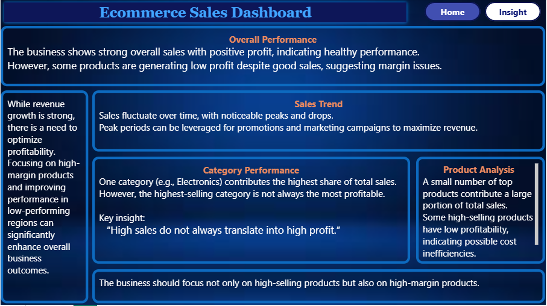

📊 Ecommerce Sales Dashboard | Power BI

📌 Project Overview

This project presents an interactive Ecommerce Sales Dashboard built in Microsoft Power BI to analyze sales performance, profitability, product performance, category contribution, and regional trends.

The dashboard transforms raw ecommerce sales data into meaningful business insights, enabling decision-makers to monitor KPIs, identify growth opportunities, and improve profitability.

📷 Dashboard Preview
🏠 Home Dashboard

📈 Insight Dashboard

🎯 Business Objectives

1. Monitor overall sales performance
2. Track revenue and profit
3. Identify top-performing products
4. Compare sales across different regions
5. Analyze monthly sales trends
6. Discover high-performing categories
7. Generate business insights for decision making

📊 Dashboard Features

KPI Cards

✔ Total Sales

✔ Total Profit

✔ Total Quantity Sold

✔ Total Orders

Interactive Filters
 
1. Region
2. Year
3. Month
4. Visualizations
5. Sales by Category
6. Sales by Region (Donut Chart)
7. Monthly Sales Trend
8. Top Products by Sales
9. Product-wise Profit Analysis

📈 Insight Dashboard

The second page provides business recommendations instead of only visualizations.

Key Insights

Overall business is profitable.
Electronics category contributes the highest sales.
High sales do not always mean high profit.
Some products generate strong sales but low margins.
Sales fluctuate significantly throughout the year.
Improving low-performing regions can increase total revenue.

🛠 Tools Used

1. Microsoft Power BI
2. Microsoft Excel
3. Power Query
4. DAX (Data Analysis Expressions)

📂 Dataset

The dataset contains ecommerce transaction records including:

Order Information
Product
Category
Region
Sales
Profit
Quantity
Order Date

Dataset Source:

Sample Ecommerce Dataset (Modified for Analysis)

📌 KPIs Used
Total Sales
Total Profit
Total Orders
Total Quantity
Sales by Category
Sales by Region
Monthly Sales Trend
Product Profit Ranking

📁 Project Structure

Ecommerce-Sales-Dashboard/
│
├── Dashboard.pbix
├── ecommerce_sales_data.xlsx
├── clean.py
├── images/
│   ├── home.png
│   └── insight.png
└── README.md

🚀 How to Use

Download the repository.
Open the .pbix file using Power BI Desktop.
Refresh the dataset if needed.
Explore the dashboard using slicers and interactive visuals.

📊 Skills Demonstrated

Data Cleaning
Data Modeling
DAX Calculations
Dashboard Design
Business Intelligence
Data Visualization
Business Insight Generation
Interactive Reporting

💡 Business Recommendations

Focus on improving profit margins rather than only increasing sales.
Invest more in high-performing product categories.
Optimize low-profit products.
Increase marketing during peak sales months.
Improve sales strategies in underperforming regions.

⭐ Future Improvements
Customer Segmentation
Profit Forecasting
Sales Forecast
Drill-through Pages
Dynamic Tooltips
Inventory Analysis
Customer Lifetime Value Analysis

👨‍💻 Author

Muhammad Muneeb Mehmood

Data Analyst

GitHub:

https://github.com/MuneebMehmood260

LinkedIn:

www.linkedin.com/in/muneeb-mehmood01

⭐ If you found this project useful, don't forget to Star this repository!