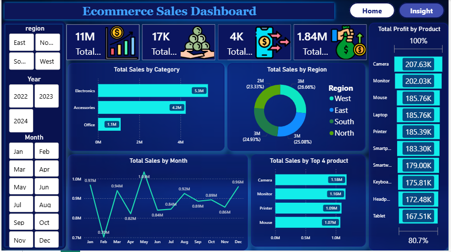

# 📊 Ecommerce Sales Dashboard | Power BI

<p align="center">
  
  
  
  
  
</p>

---

# 📖 Overview

The **Ecommerce Sales Dashboard** is an interactive Business Intelligence solution developed using **Microsoft Power BI** to analyze ecommerce sales performance, profitability, customer purchasing behavior, product performance, and regional sales trends.

The dashboard transforms raw sales data into meaningful business insights using **Power BI, Power Query, DAX, and Python** for data preparation. It enables users to monitor KPIs, identify business opportunities, and make data-driven decisions through interactive visualizations.

---

# 🎯 Project Objectives

- Analyze overall ecommerce sales performance.
- Monitor revenue and profitability.
- Compare sales across different regions.
- Identify top-performing products and categories.
- Track monthly sales trends.
- Generate actionable business insights.
- Build an interactive dashboard for decision-makers.

---

# 📷 Dashboard Preview

## 🏠 Home Dashboard

<p align="center">
    
</p>

---

## 💡 Insight Dashboard

<p align="center">
    
</p>

---

# 📊 Dashboard Features

### 📌 KPI Cards

- 💰 Total Sales
- 💵 Total Profit
- 📦 Total Orders
- 📱 Total Quantity Sold

### 📊 Interactive Visualizations

- Sales by Category
- Sales by Region
- Monthly Sales Trend
- Top Performing Products
- Product Profit Analysis
- Interactive Slicers
- Business Insights Page

---

# 🛠️ Tech Stack

| Technology | Purpose |
|------------|---------|
| Microsoft Power BI | Dashboard Development |
| Power Query | Data Transformation |
| DAX | Measures & KPIs |
| Microsoft Excel | Dataset |
| Python (Pandas & Matplotlib) | Data Cleaning & Analysis |

---

# 📂 Dataset

The dashboard is built using an ecommerce sales dataset containing:

- Order Information
- Product Details
- Category
- Region
- Sales
- Profit
- Quantity
- Order Date

---

# 📈 Key Insights

- Electronics generated the highest overall sales.
- High sales do not always result in high profit margins.
- Monthly sales show noticeable fluctuations throughout the year.
- A small number of products contribute a significant portion of total revenue.
- Regional performance varies, highlighting opportunities for growth.
- Business decisions should focus on both sales volume and profitability.

---

# 🚀 Skills Demonstrated

- Data Cleaning using Python
- Data Transformation
- Power Query
- Data Modeling
- DAX Measures
- KPI Design
- Dashboard Development
- Business Intelligence
- Data Visualization
- Business Storytelling

---

# 📁 Repository Structure

```text
Ecommerce-Sales-Dashboard/
│
├── Dashboard/
│   └── Ecommerce Sales Dashboard.pbix
│
├── Dataset/
│   └── ecommerce_sales_data.xlsx
│
├── Python/
│   └── clean.py
│
├── images/
│   ├── home.png
│   └── insight.png
│
└── README.md
```

---

# ⚙️ Getting Started

### 1. Clone Repository

```bash
git clone https://github.com/MuneebMehmood260/Ecommerce_Sale_Dashboard/tree/main
```

### 2. Open Power BI Desktop

Open the dashboard file:

```text
Dashboard/Ecommerce Sales Dashboard.pbix
```

### 3. Refresh Dataset

Refresh the data source if required.

### 4. Explore Dashboard

Use the interactive slicers and visuals to analyze sales performance and business insights.

---

# 🐍 Python Data Cleaning

Before building the dashboard, the dataset was analyzed and cleaned using Python.

The Python script includes:

- Dataset Loading
- Data Validation
- Missing Value Checking
- Duplicate Detection
- Outlier Detection (IQR Method)
- Boxplot Visualization

---

# 🎓 Learning Outcomes

This project helped me strengthen my skills in:

- Power BI Dashboard Development
- Python for Data Analysis
- Power Query
- DAX Calculations
- Data Modeling
- KPI Reporting
- Business Storytelling
- Interactive Dashboard Design

---

# 🔮 Future Improvements

- Customer Segmentation
- Sales Forecasting
- Customer Lifetime Value Analysis
- Dynamic Tooltips
- Drill-through Reports
- Inventory Analysis
- Advanced DAX KPIs
- AI-powered Insights

---

# 👨‍💻 About Me

**Muhammad Muneeb Mehmood**

Aspiring Data Analyst passionate about transforming raw data into actionable business insights using **Power BI, Python, SQL, Excel, and Data Visualization.**

### 🔗 Connect With Me

**GitHub**

https://github.com/MuneebMehmood260

**LinkedIn**

www.linkedin.com/in/muneeb-mehmood01

---

# ⭐ Support

If you found this project useful, please consider giving it a **Star ⭐** on GitHub.

Your support motivates me to build more real-world Data Analytics and Business Intelligence projects.

---

# 📬 Feedback

Suggestions and feedback are always welcome.

Feel free to open an issue or connect with me on LinkedIn.